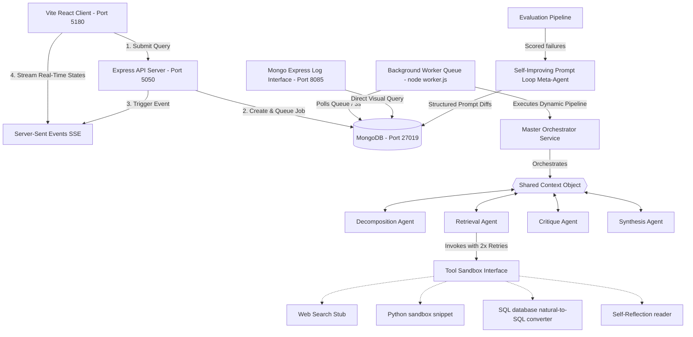

# 🚀  Multi-Agent AI Orchestration, Observability & Evaluation Engine

Mega-AI is a state-of-the-art, production-ready multi-agent AI orchestration, observability, and evaluation system built using the **MERN** stack (MongoDB, Express.js, React, Node.js) and powered by the lightning-fast **Groq API**. 

The platform implements a dynamic routing orchestrator, a rigorous evaluation pipeline, visual real-time telemetry streaming, a separate asynchronous background worker queue, and a self-improving prompt loop.

---

## 🏛️ System Architecture

The following Mermaid diagram outlines the complete multi-container network topology, shared context architecture, and background job queue:



---

## 🛠️ Complete Setup Instructions

### 🔑 Configuration (Environment Variables)
The system relies on a single root-level `.env` file for core parameters. Create or modify `.env` in the project root:

```env
GROQ_API_KEY=gsk_your_actual_api_key_here
PORT=5000
MONGO_URI=mongodb://mongo:27017/megaai
```

---

### 🐳 Option A: Multi-Container Setup via Docker Compose (Recommended)
This approach launches all 5 isolated microservices on **conflict-free host ports** to avoid collisions with any local servers you are running on your computer.

1. Ensure Docker Desktop is running.
2. Build and launch the entire stack:
   ```bash
   docker compose up --build
   ```
   *If you get an orphan naming conflict error from previous runs, simply run:*
   ```bash
   docker rm -f megaai_db
   docker compose up --build
   ```
3. **Access Services**:
   * 🖥️ **Interactive Client Dashboard**: [http://localhost:5180](http://localhost:5180)
   * 🔌 **API Server Backend**: [http://localhost:5050](http://localhost:5050)
   * 📊 **Visual Log Query interface (Mongo-Express)**: [http://localhost:8085](http://localhost:8085) *(Credentials: admin / pass)*

---

### 💻 Option B: Local Development Setup (Without Docker)

#### Prerequisites
* Node.js v20+ installed on your host.
* MongoDB running locally on `mongodb://localhost:27017`.

#### Execution Steps
1. **Launch the Backend API Server**:
   ```bash
   cd backend
   npm install
   # Ensure GROQ_API_KEY is defined in backend/.env
   npm run dev
   ```
2. **Launch the Background Worker Service**:
   ```bash
   cd backend
   npm run worker
   ```
3. **Launch the Frontend Client Dashboard**:
   ```bash
   cd frontend
   npm install
   npm run dev
   ```
4. Access the web workspace locally at [http://localhost:5173](http://localhost:5173).

---

## 🧠 Specialized Agents & Decision Boundaries

All agent communication strictly passes through a **Shared Context Schema** containing `subTasks`, `toolResults`, `critique`, and `finalAnswer`. Agents **never** communicate directly; the Orchestrator acts as the state-machine manager.

### 1. 🔀 Master Orchestrator Agent
* **Role**: Dynamic State Machine.
* **Decision Boundary**: Decides at runtime which agent has execution priority based on completed context states. Enforces the sequential progression block `Decomposition ➔ Retrieval ➔ Critique ➔ Synthesis ➔ Complete`.
* **Guardrails**: Evaluates context budgets and intercepts potential infinite loops (programmatic override) if a state transition repeats.

### 2. 🗂️ Decomposition Agent
* **Role**: Query parsing & task compiler.
* **Decision Boundary**: Triggers if the user query is marked as complex or ambiguous. Explodes the high-level prompt into typed, parallel-executable subtasks, constructing a dependency graph (e.g., Subtask B cannot run until Subtask A resolves).

### 3. 🔍 Retrieval-Augmented Agent
* **Role**: Knowledge collection & Multi-hop reasoner.
* **Decision Boundary**: Active when subtasks demand external tool knowledge. Synthesizes at least two fetched data spans to resolve queries. It parses and formats citations linking parts of its reasoning strictly back to specific source chunk IDs.

### 4. ⚖️ Critique Agent
* **Role**: Security sandbox, fact-checker, and safeguard.
* **Decision Boundary**: Reviews intermediate reasoning layers. Instead of checking whole texts, it maps assertions, flags specific spans it disagrees with, handles hallucinations, and returns structured confidence scores per claim.

### 5. ✍️ Synthesis Agent
* **Role**: Consensus builder & formatter.
* **Decision Boundary**: Merges retrieved sub-answers, resolves contradictions highlighted by the Critique Agent, formats final responses in clean markdown, and prints a structured provenance map tracing sentences back to their origin.

### 6. 🗜️ Context Budget Manager (Compression Agent)
* **Role**: Token-budget governor.
* **Decision Boundary**: Intercepts queries when an agent's workspace nears its specified token budget limit. Runs lossy conversational pruning while maintaining 100% of structured outputs (tool payloads, SQL variables, and scores).

### 7. 🧬 Self-Improving Prompt Loop Meta-Agent
* **Role**: Prompt optimizer.
* **Decision Boundary**: Triggers after an evaluation suite completes. Aggregates failed tests, determines the worst-performing agent instruction set by metric dimension, and writes an optimized prompt version.

---

## 🧬 The Self-Improving Prompt Loop: Scope & Boundaries

### What it DOES:
1. **Automatic Error Detection**: Analyzes evaluation test suite runs, filtering out all test cases scoring `< 7`.
2. **Worst-Prompt Synthesis**: Queries Groq to trace failure logs, inspect current prompt files, write an optimized prompt version, and calculate a structured `Unified Diff` with a written justification.
3. **Human-in-the-Loop Audit Trails**: Saves proposed prompt versions in the `PromptRewrite` Mongo collection as `pending`. Humans can audit proposed diffs on `GET /api/prompts/pending` and POST approval/rejection audits on `POST /api/prompts/review`.
4. **Performance Delta Metrics**: If approved, updates the prompt's version in the DB and dynamically runs a targeted evaluation *only on the previously failed cases*, recording before vs after scoring metrics to verify positive performance shift.

### What it DOES NOT:
* **Unsupervised Code Mutation**: It **never** writes directly to physical source-code variables without human audit gates. This prevents feedback loop degradation, model collapse, or prompt injection hijacks.
* **Structural Pipeline Modification**: It does not restructure the underlying MERN controller architecture, routing states, or core API parameters.

---

## ⚠️ Known Limitations & Failure Boundaries (Honest Assessment)

* **Low-Tier API Rate Limits (429s)**: The platform uses high-quality reasoning. On a standard, low-tier Groq plan, consecutive queries can quickly trigger rate limiting (6,000 TPM limit). To absorb this, our Evaluation harness has fixed sleep delays of **6000ms** per case. High-frequency queries will experience temporary back-offs.
* **Heuristic Parser Fragility**: If the LLM experiences structural hallucinations and returns malformed, non-JSON strings inside its JSON payload mode, parsing boundaries fall back to defensive text sanitizers.
* **Mocked Tool execution**: The tool stubs (Web Search, Python run, SQL Lookup) utilize high-fidelity simulation engines. In local development environments, they return high-quality mock values rather than executing untrusted binary scripts on your host's local machine.

---

## 🗺️ What We Would Build Next (Future Roadmap)

1. **🔒 Secure Sandboxed Python Runtimes**: Replace mock python scripts with isolated Docker containers or WASM runtimes (e.g., Epicbox, Pyodide) to securely run user-submitted code in production.
2. **💾 Live Semantic Vector Integrations**: Wire the SQL & Web search tools into active PostgreSQL database instances utilizing `pgvector` and external Tavily web search live APIs to run on real-time internet context.
3. **🔑 Multi-Tenant RBAC Authentication**: Add JWT/OAuth2 session scopes, allowing separate users to safely isolate queries, logs, prompt loops, and system dashboards in Multi-Agent environments.
